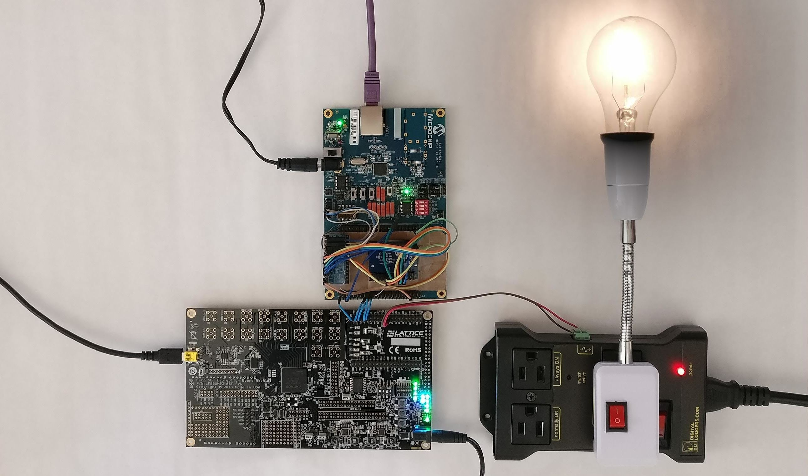

## A work-in-progress language and compiler for verified low-level programming

This repository containts ongoing work on a low-level systems programming language. One piece of the puzzle is a verified compiler targeting RISC-V. The source language itself is also equipped with a simple program logic for proving correctness of the source programs. It is not ready yet, at least for most uses.

This project has similar goals as [bedrock](https://github.com/mit-plv/bedrock), but uses a different design.
No code is shared between bedrock and bedrock2.


### Current Features

The source language is a "C-like" language called ExprImp. It is an imperative language with expressions.
Currently, the only data type is word (32-bit or 64-bit), and the memory is a partial map from words to bytes.
"Records" are supported as a notation for memory access with an offset.


### Work-in-progress features

The following features will be added soon:
*    Register allocation (spilling if more local variables are needed than registers are available)


### Non-features

It is a design decision to *not* support the following features:
*    Function pointers
*    Recursive functions (we might add them later, but we always want to prove that we don't run out of stack space)
*    Non-terminating programs (except for the top-level event loop)


### Build

You'll need [Coq](https://coq.inria.fr/). We try to support the latest released version as well as master. If unsure which version to pick, it's best to check the build log of the continuous integration server.

In case you didn't clone with `--recursive`, use `make clone_all` to clone the git submodules.

Then simply run `make` or `make -j` or `make -jN` where `N` is the number of cores to use. This will invoke the Makefiles of each subproject in the correct order, and also pass the `-j` switch to the recursive make.


### Project Overview

This repository is an umbrella repository integrating several sub-projects, allowing us to prove end-to-end theorems describing the I/O behavior of a pipelined processor executing a program written in the bedrock2 language, verified with our program logic, and compiled with our compiler.

There are the following sub-projects:

*    [coqutil](https://github.com/mit-plv/coqutil): Coq library for tactics, basic definitions, sets, maps
*    [riscv-coq](https://github.com/mit-plv/riscv-coq): RISC-V specification in Coq
*    [bedrock2/bedrock2](https://github.com/mit-plv/bedrock2/tree/master/bedrock2): The bedrock2 language, a simple C-like programming language with a program logic and a few verified sample programs
*    [bedrock2/compiler](https://github.com/mit-plv/bedrock2/tree/master/compiler): A very simple compiler from the bedrock2 language to bare metal, position independent RISC-V machine code
*    [kami](https://github.com/mit-plv/kami/tree/rv32i): Provides a 4-stage pipelined RISC-V processor
*    [bedrock2/processor](https://github.com/mit-plv/bedrock2/tree/master/processor): Proves that the hardware-centric RISC-V specification of Kami matches the software-centric specification of riscv-coq
*    [bedrock2/end2end](https://github.com/mit-plv/bedrock2/tree/master/end2end): Combines all the projects into an end-to-end theorem about a concrete program, the IoT lightbulb demo.

The Kami processor can be extracted to [bluespec](https://github.com/B-Lang-org/bsc), which can be compiled to Verilog, and run on an FPGA.

The project dependency structure looks as follows (right depends on left):

```
         bedrock2
       /          \
coqutil            compiler
       \          /         \
         riscv-coq           end2end
                  \         /
                   processor
                  /
              kami
```


### The IoT lightbulb demo



In the above picture, the FPGA at the bottom left is running the Kami processor, which executes a program proven correct using the bedrock2 program logic and compiled to bytes using the bedrock2 compiler.
Through a set of blue wires (using SPI), the FPGA is connected to an ethernet card (which we do not verify), and through a red & black wire, it is connected to a power relay which can turn on and off a lightbulb.


### Code Overview

Throughout the compiler, we use _postcondition-style semantics_, i.e. judgments of the form `exec c s P`, meaning "if we execude command `c` from starting state `s`, all possible final states satisfy the postcondition `P`, and none of the (nondeterministic) execution branches will fail.

Here's a list of files that might be interesting to step through in your IDE:
* The postcondition style semantics of the bedrock2 language are in `bedrock2.Semantics`. You might also want to look at `compiler.FlatImp`, a flattened version of it, written down in more traditional syntax.
* `bedrock2.WeakestPrecondition` contains the verification condition generator used by the program logic.
* `bedrock2Examples.swap` is a small program logic proof.
* `bedrock2.WeakestPreconditionProperties.sound_cmd` is not interesting, but confirms that the weakest precondition generator agrees with the postcondition style semantics`.
* `compilerExamples.MMIO` shows how to instantiate external calls (which are kept abstract throughout the compiler) with memory-mapped I/O (MMIO).
* To see how we connect the postcondition style to the traditional small-step semantics of Kami, you might want to start at `processor.KamiRiscv.riscv_to_kamiImplProcessor`, then look at `processor.KamiRiscvStep.kamiStep_sound`, and `compiler.CompilerInvariant.compiler_invariant_proofs` proves the assumptions made by `processor.KamiRiscv.riscv_to_kamiImplProcessor`, by using a "low level invariant" `ll_inv`, defined in `compiler.ToplevelLoop`, which says, "the current riscv state is a finite numer of steps away from a good state, where good state means a riscv state that is related to a bedrock2 state that can be observed at the end of an iteration of the toplevel event loop". Note that this "finite number of steps" might be different for each nondeterministic execution branch, so we can't just state it as `exists numberOfSteps, ...`. Instead, we use `riscv.Utility.runsToNonDet.runsTo` (that we write as ◊ in papers).
* The semantics of each riscv instruction is defined in terms of the primitives given in `riscv.Spec.Machine.RiscvProgram`.
* The function that executes a riscv instruction from the basic I extension is in `riscv.Spec.ExecuteI`, but since it has been translated from Haskell and Coq's beautify option is [broken](https://github.com/coq/coq/issues/11129), the Coq code is not very readable, so you have to read [ExecuteI.hs](https://github.com/mit-plv/riscv-semantics/blob/master/src/Spec/ExecuteI.hs) form the Haskell spec instead, or to import the `MonadNotations` and do `Print ExecuteI.execute` inside Coq to read it.
* To see how we instaniate this generic `RiscvProgram` monad into something that does postcondition style, you can look at `riscv.Platform.MinimalMMIO`.


### Compiler Overview

Here are the names of the languages and the compiler phases between them:

```
Syntax.cmd
  ↓ FlattenExpr
FlatImp.stmt string
  ↓ RegRename
FlatImp.stmt Z
  ↓ FlatToRiscv
list Instruction
  ↓ instrencode
list byte
```

The compiler provides two interfaces:


#### 1) The "more traditional" interface:

Input:
-    list of bedrock2 functions
-    name of "main"

Output:
-    Compiled functions as list of instructions
-    Relative position of main function

Correctness theorem: `compiler.PipelineWithRename.compiler_correct`:
-    If all high-level executions satisfy `post`, running the compiled program from a "good" initial RISC-V machine leads only to machines whose memory and I/O trace satisfy `post`.


#### 2) The event loop interface:

Input:
-    list of bedrock2 functions, name of "init" and "loop". This will result in the following program being compiled:

```
init();
while (true) {
   loop();
}
```

Output:
-    list of instructions to initialize the stack pointer, call `init()`, call `loop()`, jump back to calling `loop()` followed by the compiled functions
-    Meant to start execution at beginning of this list

Correctness theorem: `compiler.CompilerInvariant.compiler_invariant_proofs`:
-    There is an invariant `inv` on RISC-V machines, and
     *    Here's how to establish `inv`
     *    Running the machine for one step preserves `inv`
     *   `inv` implies that the I/O trace of the machine is good
- We call this the "establish/preserve/use pattern"
